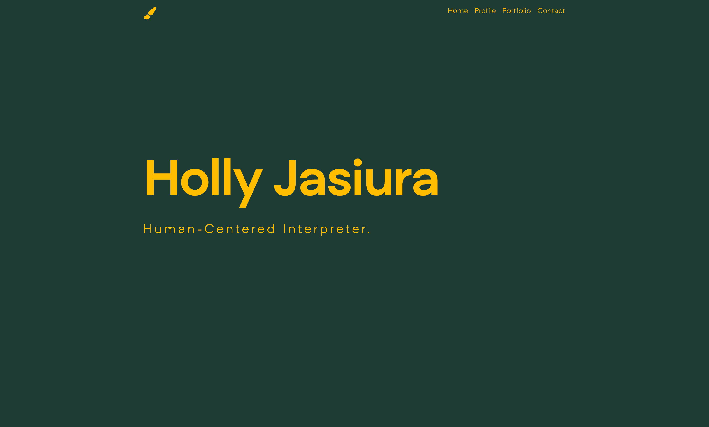
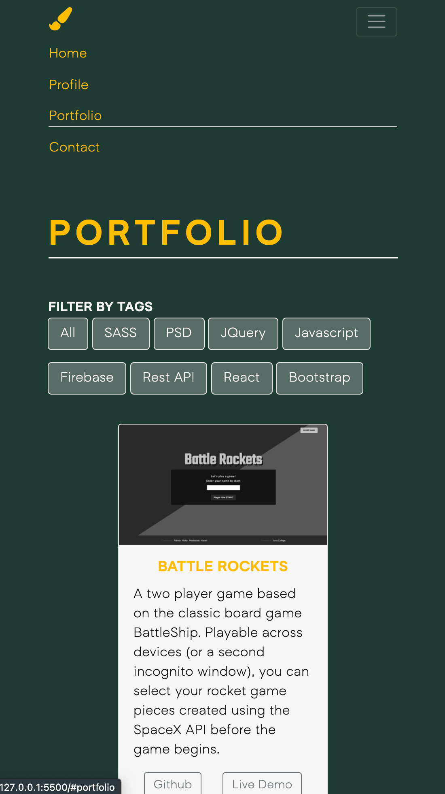

# Portfolio Website

Welcome and thank you so much for visiting!

## Table of contents

- [Overview](#overview)
  - [The challenge](#the-challenge)
  - [Screenshot](#screenshot)
  - [Links](#links)
- [Built with](#built-with)
- [Acknowledgments](#acknowledgments)

## Overview

### The challenge

Create a responsive portfolio website to showcase all the cool stuff I've built.

### Screenshot

### Links

- Github URL: [https://www.github.com/holjas/ChatApp](https://github.com/holjas/thisIsHollyJ)
- Live Site URL: [https://github.holjas.io/ChatApp](hhttps://www.thisIsHollyJ.com)

## Built with

- Semantic HTML5 markup
- Sass (SCSS)
- Bootstrap
- jQuery
- jQuery plugin's for extra flare 🌈

## Acknowledgments

Text animation credit to https://www.jqueryscript.net/animation/Simple-jQuery-Text-Rotator-with-CSS3-Animations.html
Portfolio filter grid by AutoFilter (https://github.com/GianlucaChiarani/AutoFilter)
Colour matching is thanks to https://randoma11y.com/ for some great colour generations w/ contrast ratings
